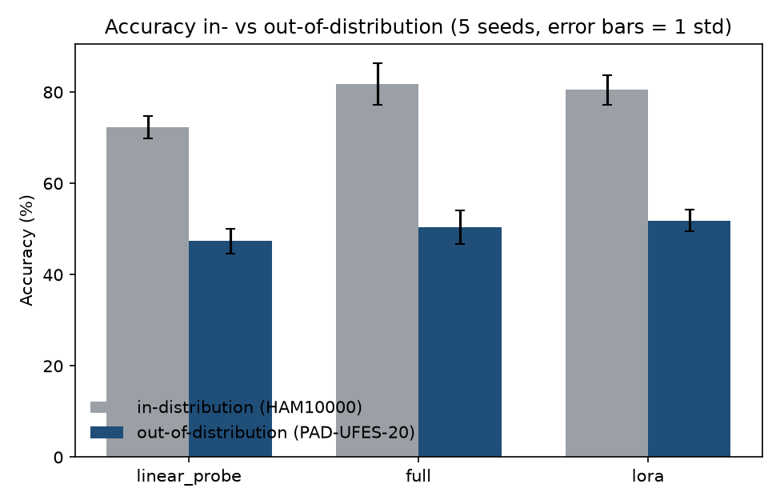
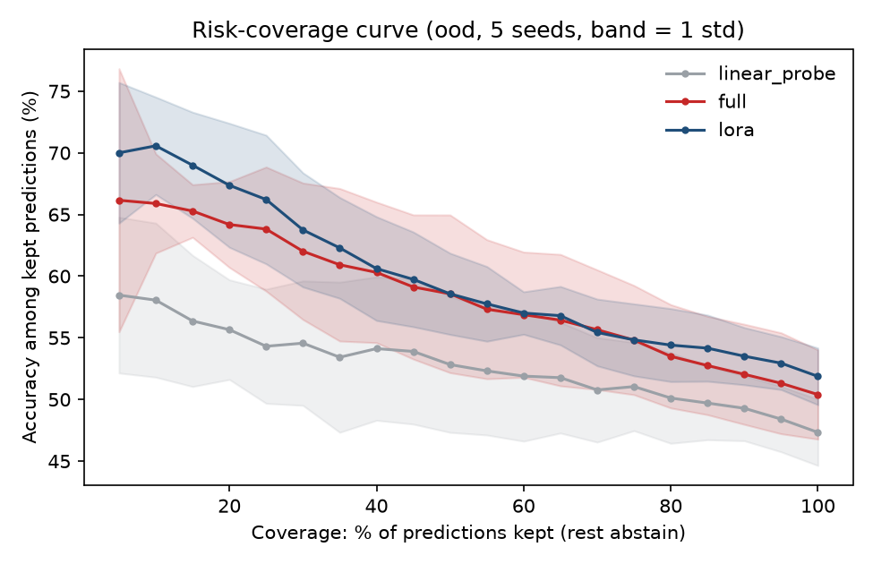

# Fine-tuning under distribution shift: skin lesion classification with LoRA-family methods

> **Status: v1 complete (2026-09-23).** All three methods trained and evaluated in- and out-of-distribution across 5 seeds, plus a single-seed shortcut probe — see "Results" below. Only pushing to GitHub is left (roadmap). Other PEFT methods (DoRA, LoRA+, VeRA, AdaLoRA) and a second shift remain future work, not v1 scope.

> **Research and education only.** Not medical advice, and not a diagnostic tool.

## Goal

Fine-tune a pretrained vision model to classify skin lesions using LoRA-family parameter-efficient methods, then test it on images from a **different source than it was trained on**, and study how it fails.

## Why this question

Medical AI models often lose accuracy when they meet data from a different hospital, camera or population. That is called *distribution shift*. A model can also score well by learning shortcuts (a ruler, a sticker, a colour cast, a hospital-specific look) instead of the lesion itself, and then fail elsewhere. Accuracy on a familiar test set hides all of this.

The study asks whether cheaper fine-tuning methods behave differently from full fine-tuning under shift. This is an open question and the answer could go either way. It also asks whether the model's confidence stays honest after the shift, and whether abstaining when unsure catches its mistakes.

## Results (v1, 5 seeds)

**What "seed" varies here:** each seed controls both the lesion-level train/val/in-distribution-test split *and* model init/data order, so these 5 runs are a broader robustness check than 5 inits on one fixed split — described precisely so it isn't mistaken for the narrower kind of multi-seed study. All 5 epochs, default hyperparameters (no tuning). Numbers below are mean ± 1 standard deviation across seeds 0, 1, 2, 3, 42.

| Method | Trainable params | ID accuracy | OOD accuracy | Accuracy drop | ID ECE | OOD ECE | Median train time |
|---|---:|---:|---:|---:|---:|---:|---:|
| Linear probe | 0.01% | 72.4% ± 2.5 | 47.3% ± 2.7 | 25.0 ± 1.4 pts | 0.073 ± 0.023 | 0.172 ± 0.048 | 13.6s |
| Full fine-tune | 100% | 81.7% ± 4.6 | 50.4% ± 3.6 | 31.3 ± 4.0 pts | 0.072 ± 0.020 | 0.136 ± 0.031 | 24.0s |
| LoRA | 1.35% | 80.5% ± 3.3 | 51.9% ± 2.3 | 28.6 ± 2.0 pts | 0.092 ± 0.027 | 0.230 ± 0.055 | 21.1s |

**What holds up across seeds:**
- All three methods lose 25-31 accuracy points on the out-of-distribution set, consistently across seeds (std of the drop is 1.4-4.0 points, far smaller than the drop itself). The shift is real, substantial, and not a fluke of one run — this is the headline the whole project is built to demonstrate.
- LoRA's OOD accuracy point estimate (51.9%) is still the highest of the three, and full fine-tuning's accuracy drop (31.3 pts) is still the largest despite the best ID accuracy. **But a Welch's t-test on LoRA vs. full fine-tune OOD accuracy gives t = 0.77 (diff = 1.5 pts, df ≈ 6.8)** — nowhere near significant. The apparent "LoRA beats full fine-tuning out-of-distribution" story from the earlier single-seed run **does not hold up** under proper multi-seed testing. This is the most important result of v1: a plausible single-run finding turned out to be noise, and checking that mattered more than the original result.
- Calibration still doesn't track accuracy: full fine-tuning has the best OOD ECE (0.136) despite the worst accuracy drop, and LoRA has the worst OOD ECE (0.230) despite the best accuracy. That pattern held from the single-seed run through the multi-seed one — accuracy and calibration are measuring different things, and reporting only one would have hidden this.

Abstaining on low-confidence predictions helps every method: LoRA and full fine-tuning both climb from ~50% accuracy at full coverage to ~66-70% among the most confident 5-10% of predictions, with linear probe consistently a few points behind across the whole curve. Shaded bands are ±1 std across seeds; they overlap substantially between LoRA and full fine-tuning, consistent with the t-test above.

### Shortcut probe (single seed, diagnostic only)

Question 5 from above: does the model rely on border content (rulers, ID stickers, vignetting) rather than the lesion itself? Tested by center-cropping each out-of-distribution image to the middle 60% by side length (removing the outer ~64% of the frame by area, `skinshift/shortcut_probe.py`) and comparing accuracy before and after, on the same trained model (seed 42 only — this is a diagnostic, not a claim at the level of the 5-seed table above).

| Method | OOD accuracy, original | OOD accuracy, cropped | Change |
|---|---:|---:|---:|
| Linear probe | 48.0% | 46.8% | -1.2 pts |
| Full fine-tune | 46.2% | 46.6% | +0.4 pts |
| LoRA | 51.2% | 51.8% | +0.6 pts |

**No evidence of border-shortcut reliance for any method:** removing nearly two-thirds of each image's area by cropping to the center changed accuracy by at most 1.2 points, in either direction. This is a negative result and is reported as one, not reframed as something else. It only tests one specific hypothesis (border/edge content); it does not rule out other shortcuts such as colour cast or capture-device artefacts, and one seed is not enough to say the true effect is exactly zero rather than small.

**Two things found and fixed while producing these numbers, left in for the record:**
- One `lora` run silently overlapped with a monitoring script that re-ran the same seed concurrently, inflating that run's *training-time* measurement ~40x (GPU contention, not a real cost). The comparison table reports the **median** training time across seeds for exactly this reason — the accuracy/calibration numbers from that run were unaffected and are included normally.
- The first version of the multi-seed risk-coverage plot used `np.interp` on an array that wasn't sorted ascending (a real bug, not a data issue), which silently produced a near-flat, wrong curve. Caught by inspecting the figure rather than trusting the numbers, fixed, and locked in with a regression test (`tests/test_report.py`).

## Planned study

**Task.** Classify skin lesion images into diagnostic categories.

**Data — source and access confirmed and downloaded (2026-09-22).**

Both sides are sourced from the [ISIC Archive API](https://api.isic-archive.com) (`skinshift/download.py`), not the raw Mendeley bulk files. The Mendeley PAD-UFES-20 zips (~3.6GB, discovered to be prohibitively slow to fetch in this environment: ~0.34MB/s measured, ~3h for the full set) were **not used**; the ISIC Archive hosts a resized copy of the same PAD-UFES-20 images (CC-BY, confirmed identical class counts against the original Mendeley `metadata.csv`) at 8-140KB/image instead of ~1.6MB/image, making the whole subset a few tens of MB.

| Dataset | Role in v1 | Source | Confirmed |
|---|---|---|---|
| HAM10000 | Training / in-distribution val+test (dermoscopic) | ISIC Archive collection id 212 | 11,720 images in the collection; license **CC-BY-NC** (checked per-image via the API, not assumed); `lesion_id` present in metadata for the lesion-level split. |
| PAD-UFES-20 | Out-of-distribution test (smartphone clinical, `image_type: "clinical: close-up"`) | ISIC Archive collection id 406 | 2,298 images; license **CC-BY**, attribution "Federal University of Espírito Santo (UFES)"; per-class counts (BCC 845, actinic keratosis 730, nevus 244, melanoma 52) match the original Mendeley `metadata.csv` exactly — cross-checked as a sanity check on the data source. |

**Why this pair:** dermoscopy-to-smartphone is the larger, more realistic shift (different device *and* modality, not just a different clinic). Both collections use the **same normalised `diagnosis_3` taxonomy** in the ISIC Archive's shared schema, confirmed directly against the API — no manual class-name alignment was needed. v1 uses the 4 classes both share with an unambiguous meaning: melanoma ("Melanoma, NOS"), basal cell carcinoma, actinic keratosis ("Solar or actinic keratosis"), nevus. SCC / seborrheic or benign keratosis / dermatofibroma / vascular lesion are dropped for v1 (a v2 item if time allows).

**Downloaded subset (per-class caps; actual counts logged by `skinshift/download.py`):**

| Class | HAM10000 (train, cap 220) | PAD-UFES-20 (OOD test, cap 150) |
|---|---:|---:|
| Melanoma | 220 | 52 (all available) |
| Basal cell carcinoma | 220 | 150 |
| Actinic keratosis | 149 (all available) | 150 |
| Nevus | 220 | 150 |
| **Total** | **809** | **502** |

HAM10000's 809 images are further split **by lesion** (`skinshift/data.py::lesion_split`, tested in `tests/test_data.py`) into train / val / in-distribution-test, so no lesion's images appear in more than one split.

**Model and methods (decided for v1; confirmed working end-to-end, `skinshift/model.py` + `skinshift/train.py`).**
- Model: `WinKawaks/vit-tiny-patch16-224` (5,525,188 parameters) — fits comfortably in memory, loads and runs a forward pass on MPS (Apple Silicon GPU) in ~8s. LoRA targets `q_proj`/`v_proj` (checked directly against `model.named_modules()` — this transformers version names ViT's attention projections `q_proj`/`k_proj`/`v_proj`/`o_proj`, not the older `query`/`value`).
- **v1 methods (3, as scoped), with trainable-parameter counts confirmed:**

  | Method | Trainable params | % of 5.5M total |
  |---|---:|---:|
  | Linear probe (frozen backbone) | 772 | 0.01% |
  | LoRA (r=8, q_proj+v_proj, classifier head) | 74,500 | 1.35% |
  | Full fine-tune | 5,525,188 | 100.00% |

- **Cut from v1, moved to later / stretch:** DoRA, LoRA+, VeRA, AdaLoRA, LoRA-FA, QLoRA, multi-seed runs, and the subgroup-by-patient-metadata analysis. One week is not enough to do all of that *and* have it be trustworthy; a fast, honest 3-method result beats a rushed 6-method one.

**Questions.**
1. How large is the drop when a model is tested on a different source?
2. Do parameter-efficient methods hold up better or worse than full fine-tuning under shift?
3. Is the model's confidence still calibrated after the shift?
4. Does abstaining when uncertain remove the errors caused by the shift?
5. Does the model rely on shortcuts such as rulers, markers or colour cast? (Probed by masking and cropping.)
6. Does performance differ by patient group where metadata allows? Group sizes will be small, so error bars will be wide.

**Metrics.** Macro-averaged F1 and per-class recall (the classes are imbalanced), calibration (ECE, negative log-likelihood), risk-coverage curves for abstention, and cost (trainable parameters, memory, training time).

## Rules the study will follow

- Split **by lesion**, not by image, wherever a dataset contains several images of one lesion.
- Check for overlap between sources so that no external test image was seen in training.
- Tune hyperparameters on validation data only, never on the external test set.
- Report mean and standard deviation over multiple seeds.
- Generate tables and figures by script from saved run files. Nothing is typed into this README by hand.

## Decisions (locked for v1)

- [x] Shift: dermoscopy (ISIC 2019) &rarr; smartphone (PAD-UFES-20), shared 4-class subset
- [x] Methods: frozen linear probe, full fine-tune, LoRA (3 total)
- [x] Model: small ViT (exact checkpoint confirmed Day 1)
- [x] Time budget: 1 week, part-time

## 1-week plan

| Day | Work | Exit check |
|---|---|---|
| 1 | Confirm ISIC 2019 license/access; download the class-balanced subset + PAD-UFES-20; pick and load the ViT checkpoint; environment set up | Both datasets loadable, model forward pass runs |
| 2 | Data pipeline: lesion-level split, overlap check between the two sources, dataloaders, class balancing | A batch trains one step without error |
| 3 | Linear-probe baseline + full fine-tune, in-distribution results | Both methods trained and scored on the ISIC held-out set |
| 4 | LoRA fine-tune; all three methods evaluated in-distribution and out-of-distribution (PAD-UFES-20) | Headline accuracy-drop table exists |
| 5 | Calibration (ECE) and a basic risk-coverage/abstention curve for all three methods | Calibration numbers exist and are sanity-checked |
| 6 | Shortcut probe (mask/crop test) if time allows; figures; write results into the README with real numbers | README's "planning" banner can be removed |
| 7 | Buffer: fix whatever broke, polish, push to GitHub | Repo is postable |

This is a tight, honest v1, not the full study. Multi-seed error bars, the other four PEFT methods, and subgroup analysis are explicitly **not** in this week; the README will say so rather than imply more than was done.

## Roadmap

- [x] Day 1: confirm data access/license; download data; environment set up — done. 1,311 images (809 train, 502 OOD), all 8 tests pass, model forward pass confirmed on MPS.
- [x] Day 2: lesion-level splits, overlap check, dataloaders — done (`skinshift/data.py`, tested). One 1-epoch smoke run confirmed the full pipeline end to end: train=564, val=119, id_test=126, ood=502.
- [x] Day 3: linear-probe baseline + full fine-tune, properly trained and evaluated in-distribution — done, then extended to 5 seeds per method
- [x] Day 4: LoRA; in-distribution + out-of-distribution eval for all 3 methods; `skinshift/report.py` comparison table + figures — done
- [x] Day 5: calibration + abstention (risk-coverage), 5 seeds with std bands — done; caught and fixed a real interpolation bug along the way (see Results)
- [x] Day 6: shortcut probe — done (see Results); no evidence found of border-shortcut reliance
- [ ] Day 7: push to GitHub
- [ ] *(beyond v1)* DoRA, LoRA+, VeRA, AdaLoRA, multi-seed runs, subgroup analysis, HAM10000 as a second shift

## Limitations to state up front

- A benchmark result is not clinical validity.
- Labels come from different sources with different confirmation standards (biopsy versus consensus).
- Small subgroups will give wide uncertainty.
- Some dermatology datasets carry non-commercial licenses, which will be checked and stated.

## License

MIT (code). Dataset licenses are separate and are listed above as they are confirmed.
